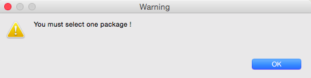

#Modelio-SUCN
SUCN stands for Simple Use Case Notation. It's a simple language made to improve usecases understanding and creation. The project is bundled as a module for Modelio 3.2 and it allows :
- the creation of usecases via SUCN inside Modelio
- the translation of existing usecases inside Modelio into SUCN.

SUCN grammar is provided in section 8.

This project is based on :
- https://github.com/megaplanet/Modelio3WorkspaceGenOCL-G99 by https://github.com/megaplanet

##0. Summary
- [1. Simple UseCase Notation for Modelio](https://github.com/MarcAlx/Modelio-SUCN#1-simple-usecase-notation-for-modelio)
- [2. Requirements](https://github.com/MarcAlx/Modelio-SUCN#2-requirements)
- [3. Authors](https://github.com/MarcAlx/Modelio-SUCN#3-authors)
- [4. Code](https://github.com/MarcAlx/Modelio-SUCN#4-code)
- [5 Usage](https://github.com/MarcAlx/Modelio-SUCN#5-usage)
-  [5.1 Modelio setup](https://github.com/MarcAlx/Modelio-SUCN#51-modelio-setup)
-  [5.2. import](https://github.com/MarcAlx/Modelio-SUCN#52-import)
-   [5.2.1 Import a file](https://github.com/MarcAlx/Modelio-SUCN#521-import-a-file)
-   [5.2.2 Write SUCN instructions](https://github.com/MarcAlx/Modelio-SUCN#522-write-sucn-instructions)
-  [5.3 export to .sucn file](https://github.com/MarcAlx/Modelio-SUCN#53-export-to-sucn-file)
- [6. SUCN Grammar](https://github.com/MarcAlx/Modelio-SUCN#6-sucn-grammar)
- [7. Mapping SUCN/Modelio](https://github.com/MarcAlx/Modelio-SUCN#7-mapping-sucnmodelio)
- [8.Testcases](https://github.com/MarcAlx/Modelio-SUCN#8testcases)
-  [8.1 SUCN import testcases](https://github.com/MarcAlx/Modelio-SUCN#81-sucn-import-testcases)
-  [8.2 SUCN export testcases](https://github.com/MarcAlx/Modelio-SUCN#82-sucn-export-testcases)
- [9. Screenshot](https://github.com/MarcAlx/Modelio-SUCN#9-screenshot)


##1. Simple UseCase Notation for Modelio

SUCN - スケン

This code converts SUCN text to usecase in modelio, documentation used :
- http://modelioscribes.readthedocs.org/en/latest/UseCaseScribe.html
- https://www.modelio.org/documentation/javadoc-3.1/org/modelio/api/model/IUmlModel.html
- https://gist.github.com/megaplanet/9815128

##2. Requirements
- Modelio 3.2.1

##3. Authors
Group225 from IDM at UFRIM2AG
- (MBD) Marc-Alexandre Blanchard
- (EKA) Enis Kulla 

##4. Code 
Code is located inside 'macros' folder
in files :
- import.py for import
- export.py for export
- .catalog for menu configuration

##5 Usage
###5.1 Modelio setup
**/!\ do not press 'Import' before project selection. If you do this you will get an exception and you won't be able to import SUCN unless you restart Modelio**
- Launch Modelio
- File menu -> switch workspace
- Choose 'Modelio-SUCN' folder
- Relaunch Modelio (in order to have access to menu)
- Open 'UseCases' project or create a new one
- Use menu to work with modules : 'Import' or 'Export selected package to .sucn file'
- 

The workspace cames with a project called 'UseCases' you can use it or create your own project. 

When you make an import procedure a package called 'SUCN Package' will be created, the module also creates a use case diagram in order to allow drag n drop of the created elements in order to visualize results.

###5.2. import
- Click on import, a window will open
- 

In this window you will have two ways of translation :
- Import a file
- Write SUCN instructions in textarea

####5.2.1 Import a file
**/!\ all existing content inside 'SUCN Package' will be deleted**
- Press 'import .sucn file button'
- Choose a .sucn file (extension must be .sucn)
- 

####5.2.2 Write SUCN instructions
**/!\ all existing content inside 'SUCN Package' will be deleted**
- Write code inside textarea (one instruction a line)
- Then press 'Translate'

NB : You can also save your inputs in order to use it later via 'save as .sucn' button

###5.3 export to .sucn file
- Create a use case diagram via modelio
- Select the package that contains the diagram
- Clic on "Export selected package to .sucn file"

NB : 
- Actor and UseCase in Modelio, must not contains space into their names.
- if you select something else than a package or more than one package you will get a pop up like this :
- 

##6. SUCN Grammar
| Purpose                                          | Grammar                                        | Example             |
|--------------------------------------------------|------------------------------------------------|---------------------|
| actor creation                                   | actor (actor-name)                             | actor A1            |
| actor inheritance                                | (actor-name) -isparentof- (actor-name)       | A1 -isparentof- A2  |
| actor uses a usecase | (actor-name) -uses- (usecase-name)             | A1 -uses- U2        |
| usecase linked to a usecase | (usecase-name) -islinkedto- (usecase-name)     | U1 -islinkedto- U2  |
| usecase creation                                 | usecase (usecase-ame)                          | usecase U1          |
| usecase inclusion                                | (usecase-name) -includes- (usecase-name)       | U1 -includes- U2    |
| usecase inheritance                              | (usecase-name) -extends- (usecase-name)        | U1 -extends- U2     |
| comments ((inside code) not processed)           | --(comment-text)                               | --a comment         |

NB : 
- A space is required between operands and operator
- (actor-name) or (usecase-name) must not contains spaces
- Actors and Usecases are dynamically created as they are declared, if they are not created via 
```
'actor (actor-name)'  or 'usecase (usecase-name)'
```
- You can declare multiple actors or usecases where there is (actor-name) or (usecase-name). Just seprarate them by space
```
--example
a b c -islinkedto- d e f
--this will link a to d e f, b to d e f, c to d e f
```
```
--example
a -islinkedto- d e f
--this will link a to d e f
```
```
--example
actor a1 a2
--this will created 2 actors a1 and a2
```

##7. Mapping SUCN/Modelio
|SUCN relation|Modelio relation|
|--------------|----------------|
|-uses-|communication link|
|-islinkedto-|communication link|
|-isparentof-|generalization|
|-includes-|inclusion relationship|
|-extends-|extension relationship|

##8.Testcases

###8.1 SUCN import testcases
Some import testcases are provided as .sucn files in folder 'SUCN testcases import':
- actor_creation.scn -> actor creation
- actor_extension.sucn -> actor extension
- actor_usecase_link.sucn -> actor link to a usecase
- comment.sucn -> comment
- test.sucn -> a simple test
- usecase_creation.sucn -> usecase creation
- usecase_extension.sucn -> usecase extends another useace
- usecase_inclusion.sucn -> usecase includes antoher usecase
- usecase_link.sucn -> usecase is link to another usecase
- multiple_uses.sucn -> multiple actor use multiple usecase
- multiple_isparentof.sucn -> multiple actor are parent of multiple actors
- multiple_islinkedto.sucn -> multiple usecases are linked to multiple usecases
- multiple_includes.sucn -> multiple usescases includes multiple usecases
- multiple_extends.sucn -> multiple usescases extends multiple usecases

###8.2 SUCN export testcases
Some export testcases are provided as a modelio project : 'export-testcases', try export on packages :
- actor_creation -> actor creation
- actor_extension -> actor extension
- actor_usecase_link-> actor link to a usecase
- usecase_creation -> usecase creation
- usecase_extension -> usecase extends another useace
- usecase_inclusion -> usecase includes antoher usecase
- usecase_link -> usecase is link to another usecase
- test -> a simple test

NB : .sucn files generated from these testcases are provided as examples inside : 'SUCN generated from export_testcases' folder.

##9. Screenshot
- A translatation via user input :
- 
