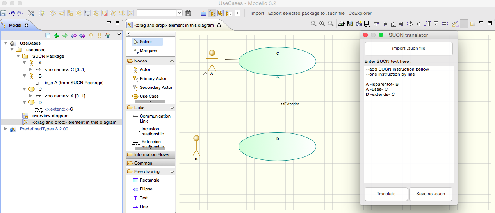

#Modelio-SUCN

##0. Base project
This project is based on :
- https://github.com/megaplanet/Modelio3WorkspaceGenOCL-G99

##1. Simple UseCase Notation for Modelio

SUCN - スケン

This code converts SUCN text to usecase in modelio, documentation used :
- http://modelioscribes.readthedocs.org/en/latest/UseCaseScribe.html
- https://www.modelio.org/documentation/javadoc-3.1/org/modelio/api/model/IUmlModel.html
- https://gist.github.com/megaplanet/9815128

##2. Requirements
- Modelio 3.2.1

##3. Authors
Group225 from IDM at UFRIM2AG
- (MBD) Marc-Alexandre Blanchard
- (EKA) Enis Kulla 

##4. Code 
Code is located inside 'macros' folder
in files :
- import.py for import
- export.py for export
- .catalog for menu configuration

##5. Usage - Modelio setup
Warning : do not press 'Import' before project selection. If you do this you will get an exception and you won't be able to import SUCN unless you restart Modelio
- Launch Modelio
- File menu -> switch workspace
- Choose 'Modelio-SUCN' folder
- Relaunch Modelio (in order to have access to menu)
- Open 'UseCases' project or create a new one
- Use menu to work with modules : 'Import' or 'Export selected package to .sucn file'
- 

The workspace cames with a project called 'UseCases' you can use it or create your own project. 

When you make an import procedure a package called 'SUCN Package' will be created, the module also creates a use case diagram in order to allow drag n drop of the created elements in order to visualize results.

##6. Usage - import
- Click on import, a window will open
- 

In this window you will have two ways of translation :
- Import a file
- Write SUCN instructions in textarea

###6.1 Import a file
**/!\ all existing content inside 'SUCN Package' will be deleted**
- Press 'import .sucn file button'
- Choose a .sucn file (extension must be .sucn)
- 

###6.2 Write SUCN instructions
**/!\ all existing content inside 'SUCN Package' will be deleted**
- Write code inside textarea (one instruction a line)
- Then press 'translate'
NB : You can also save your inputs in order to use it later via 'save as .sucn' button

##7. Usage - export .sucn file
- Create a use case diagram via modelio
- Select the package that contains the diagram
- Clic on export

##8. Grammar
| Purpose                                          | Grammar                                        | Example             |
|--------------------------------------------------|------------------------------------------------|---------------------|
| actor creation                                   | actor (actor-name)                             | actor A1            |
| actor inheritance                                | (actorA-name) -isparentof- (actorB-name)       | A1 -isparentof- A2  |
| actor uses a usecase        (communication link) | (actor-name) -uses- (usecase-name)             | A1 -uses- U2        |
| usecase linked to a usecase (communication link) | (usecase-name) -islinkedto- (usecase-name)     | U1 -islinkedto- U2  |
| usecase creation                                 | usecase (usecase-ame)                          | usecase U1          |
| usecase inclusion                                | (usecase-name) -includes- (usecase-name)       | U1 -includes- U2    |
| usecase inheritance                              | (usecase-name) -extends- (usecase-name)        | U1 -extends- U2     |
| comments ((inside code) not processed)           | --(comment-text)                               | --a comment         |

NB : Actors and Usecases are dynamically created as they are declared, if they are not created via 
```
'actor <actor-name>'  or 'usecase <usecase-ame>'
```

##9. SUCN import testcases
Some testcases are provided as .sucn files in folder 'SUCN testcases import':
- actor_creation.scn -> actor creation
- actor_extension.sucn -> actor extension
- actor_usecase_link.sucn -> actor link to a usecase
- comment.sucn -> comment
- test.sucn -> a simple test
- usecase_creation.sucn -> usecase creation
- usecase_extension.sucn -> usecase extends another useace
- usecase_inclusion.sucn -> usecase includes antoher usecase
- usecases_link.sucn -> usecase is link to another usecase

##10. Screenshot
- A translatation via user input :
- 


